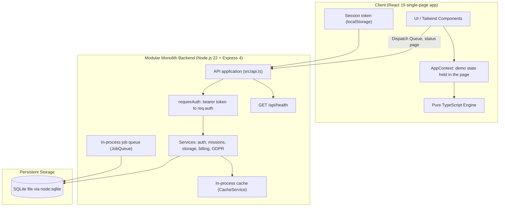

# Naiad Architecture Specification

**Product:** Naiad — Demand-pull citizen science for urban streams  
**Stage:** Hackathon prototype  
**Team Context:** Solo / Small team, low operational burden, transparent debugging.

This document describes the code in this repository. Section 7 lists what the product design calls for but the code does not do yet.

---

## 1. Component Diagram



Two halves share one repository and one pure engine:

- **The browser app** is where the product experience lives today. The map, missions, check-ins, receipts, crews, trace hunts, the coordinator console and the FHIR loop all run on demo data held in React state (`src/context/AppContext.tsx`, seeded from `src/data/`). The engine computes freshness, demand and trace posteriors in the page. Photos are samples, the GPS position and the weather are on-screen controls, and offline mode is a toggle: none of it leaves the browser.
- **The API** is a real multi-tenant backend on SQLite: sign-in, missions, storage tickets, the billing webhook and GDPR export and erasure. Only the Dispatch Queue page (missions) and the status page (health) call it.

---

## 2. Stack Choices & Alternatives

| Layer | Selected Technology | Alternative Considered | Why Alternative Was Rejected |
|---|---|---|---|
| **Frontend Framework** | **React 19 + TypeScript + Vite** | Next.js (App Router) | Next.js App Router adds SSR/hydration overhead, server action magic, and deployment lock-in. A Vite SPA gives instant local dev and is straightforward to debug. |
| **Styling** | **Tailwind CSS v4** | CSS Modules / Styled Components | Tailwind provides zero-runtime styling, standardized design tokens, and rapid UI development without context switching between stylesheets. |
| **Backend Architecture** | **Express 4 + TypeScript (Modular Monolith)** | Microservices (Go/Python) | For a team of 1–3 engineers, microservices create network boundary failures, distributed tracing complexity, and deployment overhead. A modular monolith allows sharing the pure TypeScript engine between client and server directly. |
| **Scientific Engine** | **Pure TypeScript (`src/engine/`)** | Python / NumPy backend service | Invoking Python via IPC or a separate HTTP service introduces cross-language serialization lag, double type definitions, and extra runtime dependencies. Pure TypeScript runs in both browser and server. |
| **Database** | **SQLite (`node:sqlite`, one file)** | PostgreSQL + PostGIS | A city's stream network ($\sim 500$ reaches) is small, and a file database needs no server, no credentials and no setup for a prototype. The schema (`src/db/schema.sql`) is plain relational SQL, which keeps a later move to PostgreSQL manageable. |
| **Authentication** | **Signed bearer tokens (HS256) + scrypt passwords, standard library only** | Hosted identity provider | Volunteers must be able to start with only a nickname (ADR 002), which hosted sign-in flows do not offer, and the whole scheme fits in one file (`src/services/auth.ts`). |
| **Caching** | **In-process `CacheService`** | Redis | One process, so a `Map` with expiry is enough. It has to move to a shared store before a second instance is added. |

---

## 3. Repository Folder Structure

```text
/
├── .env.example                     # Fully documented environment variable templates
├── CLAUDE.md                        # Assistant playbook & architecture guidelines
├── AGENTS.md                        # Agent environment & workflow contract
├── README.md                        # Project setup, test, and run instructions
├── index.html                       # Web entry point
├── metadata.json                    # AI Studio manifest
├── package.json                     # Dependencies, scripts (dev, start, build, test, lint)
├── tsconfig.json                    # Strict TypeScript configuration
├── vite.config.ts                   # Vite + React + Tailwind build configuration
├── playwright.config.ts             # End-to-end test configuration
├── server.ts                        # Entry point: API + frontend on one port, graceful shutdown
├── /public
│   └── theme.js                     # Applies the saved theme before the first paint
├── /docs
│   ├── architecture.md              # This architecture document
│   ├── system-design.md             # System design specification
│   ├── api-conventions.md, caching.md, frontend.md, hosting.md, monitoring.md, permissions.md, testing.md
│   ├── /decisions                   # Architecture Decision Records (ADRs)
│   ├── /runbooks                    # Deploy, rollback, backup and incident runbooks
│   └── /security                    # Threat model
├── /scripts                         # scan-secrets.ts, test-restore.ts, create-zip.py
├── /src
│   ├── api.ts                       # The Express application: every /api route and its middleware
│   ├── App.tsx                      # Providers, the page switch and the app-wide dialogs
│   ├── main.tsx                     # React DOM bootstrap
│   ├── index.css                    # Tailwind CSS v4 entry: design tokens for the light and dark themes
│   ├── theme.ts                     # Light/dark theme hook (public/theme.js applies the saved theme before paint)
│   ├── /components                  # AppShell.tsx (sidebar, top bar, footer), one file per page or dialog,
│   │   │                            # presentation.ts (display rules shared by the pages)
│   │   └── /design-system           # PageHeader, Panel, StatCard, Button, Badge/Notice/Meter, Segmented/Chips,
│   │                                # Input, Select, Modal, Table, Toast, EmptyState, ErrorState, Skeleton
│   ├── /config
│   │   └── env.ts                   # Zod-validated environment, secrets policy
│   ├── /context
│   │   └── AppContext.tsx           # Demo state & reactivity for the browser app
│   ├── /data                        # Demo networks and evidence datasets
│   │   ├── cities.ts
│   │   ├── evidenceData.ts
│   │   ├── networks.ts
│   │   └── oahQuestions.ts
│   ├── /db
│   │   ├── index.ts                 # SQLite client (opens and migrates the database)
│   │   ├── schema.sql               # The whole schema, applied idempotently
│   │   └── seed.ts                  # Demo organizations and coordinator accounts
│   ├── /engine                      # PURE SCIENTIFIC TYPESCRIPT (Zero I/O)
│   │   ├── freshness.ts             # Half-life decay and demand logic
│   │   ├── graph.ts                 # Kahn topoSort, upstream closure, arrival ETAs
│   │   ├── params.ts                # Centralized scientific parameter constants
│   │   ├── trace.ts                 # Bayesian updating, Shannon entropy, bisection
│   │   ├── simulation.ts            # Monte Carlo benchmark of trace-hunt strategies
│   │   └── /__tests__               # Scientific test suites
│   ├── /routes
│   │   ├── middleware.ts            # requireAuth, rate limits, async wrapper, the single error envelope
│   │   ├── auth.routes.ts           # /api/v1/auth (volunteer join, coordinator sign-in)
│   │   └── missions.routes.ts       # /api/v1/request-missions
│   ├── /services                    # auth, missions, storage, billing, gdpr, queue, cache, health, permissions, sentry
│   │   └── session.client.ts        # Browser side of the session (token storage, authenticated fetch)
│   ├── /types
│   │   └── index.ts                 # Complete data contracts
│   └── /utils                       # logger.ts, crypto.ts
└── /test
    ├── assert.ts                    # Shared test helpers
    ├── /integration                 # HTTP tests against the real app, service-level tests
    └── /e2e                         # Playwright flows
```

---

## 4. Where Background Work Runs and How

- **Demand generation** runs in the browser. `generateMissions` in `AppContext.tsx` applies the engine's decay and rain-shock rules to the demo reaches every time the state changes, and derives the missions shown on the map and the missions page. There is no server-side demand pass.
- **Job queue** (`src/services/queue.ts`): a `background_jobs` table in SQLite with idempotent enqueue, a per-job attempt limit and a dead letter state (`failed`). Jobs are processed in the same process, right after something is enqueued. The four handlers (`send_email`, `generate_export`, `sync_weather_api`, `dispatch_webhook`) only write a log line, and nothing in the application enqueues a job yet: the queue is infrastructure waiting for its first real producer. There is no timer or scheduler.
- **Cache sweep**: `CacheService` removes expired entries once a minute.

---

## 5. Third-Party Services

The running application calls no external service. Two are wired in and optional:

| Service | Purpose | When it is used |
|---|---|---|
| **Sentry** | Error tracking (PII scrubbed, tagged with request and tenant) | Only when `SENTRY_DSN` is set |
| **Stripe** | Subscription plan changes | Inbound only: Stripe calls `POST /api/v1/webhooks/stripe`; Naiad never calls Stripe |

---

## 6. The 3 Riskiest Decisions in This Architecture

1. **The product flows are simulated in the browser**:
   - *Risk*: The check-in, trace and FHIR flows prove the interaction and the engine, but they are not yet backed by the API. Their state is lost on reload and nothing is shared between users.
   - *Mitigation*: The schema already has tables for checks, incidents and FHIR requests, and the engine is pure, so the same functions can run behind API routes without change.
2. **One process, one SQLite file**:
   - *Risk*: The cache, the rate limits and the job queue all assume a single instance, and the database is a local file that must sit on a persistent disk.
   - *Mitigation*: Fine at prototype scale. `docs/hosting.md` lists what has to change before a second instance is added.
3. **Graph Topology Memory Representation**:
   - *Risk*: Loading entire city stream graphs into memory could fail if scaled to national river networks (>100,000 reaches).
   - *Mitigation*: Validated for urban stream pilot scale ($250\text{m}$ reaches in urban basins $<5,000$ reaches, requiring $<10\,\text{MB}$ RAM). A PostGIS or Neo4j migration is deferred until national scaling.

---

## 7. Designed but Not Implemented

These are part of the product design (see `system-design.md` and the ADRs) and are **not** in the code:

| Planned | Today |
|---|---|
| Check-ins, crews, incidents and FHIR requests stored through the API | Held in browser state only |
| Camera capture with EXIF removal on a canvas before upload (ADR 0003) | Sample photos, labelled as samples; nothing is uploaded and no removal step runs |
| Geofence checked against the device's GPS position | Distance is a control in the check-in dialog |
| Installable PWA with a service worker and an offline queue that survives reloads | No service worker or manifest; the offline queue is in memory |
| Server-side demand pass and hourly weather sync on a schedule (ADR 0002) | Demand is computed in the browser; weather is an on-screen control; no scheduler |
| Open-Meteo weather data, OpenStreetMap Overpass network extraction | Hand-built demo networks in `src/data/networks.ts`; no external calls |
| HAPI FHIR server validating `hl7.eu.fhir.oah` resources (ADR 0004) | FHIR resources are generated in the browser and not validated |
| Photo bucket (S3/R2/GCS) behind the signed storage URLs | The API issues and signs upload and download tickets; no bucket receives the files |
| Email (crew digests, alerts) | The `send_email` job handler writes a log line |
| PostgreSQL, Redis, multiple instances | SQLite, in-process cache and queue, one instance |
